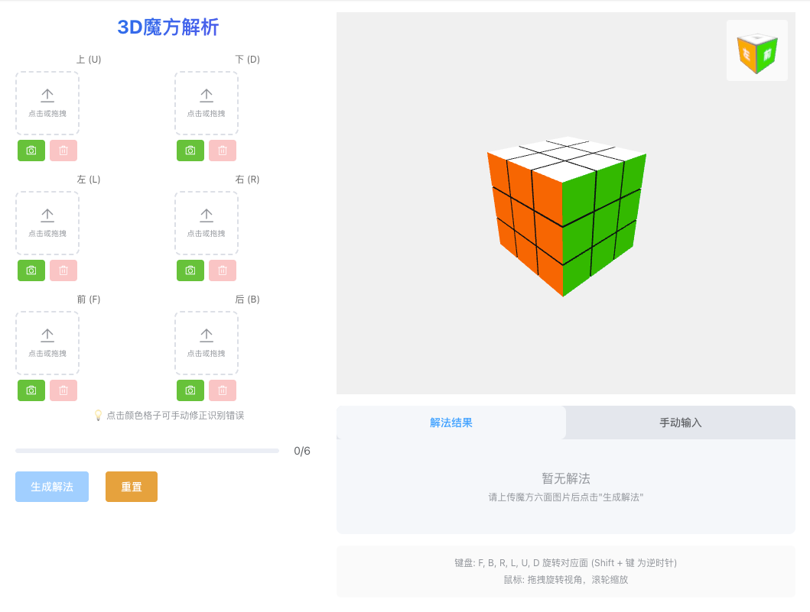
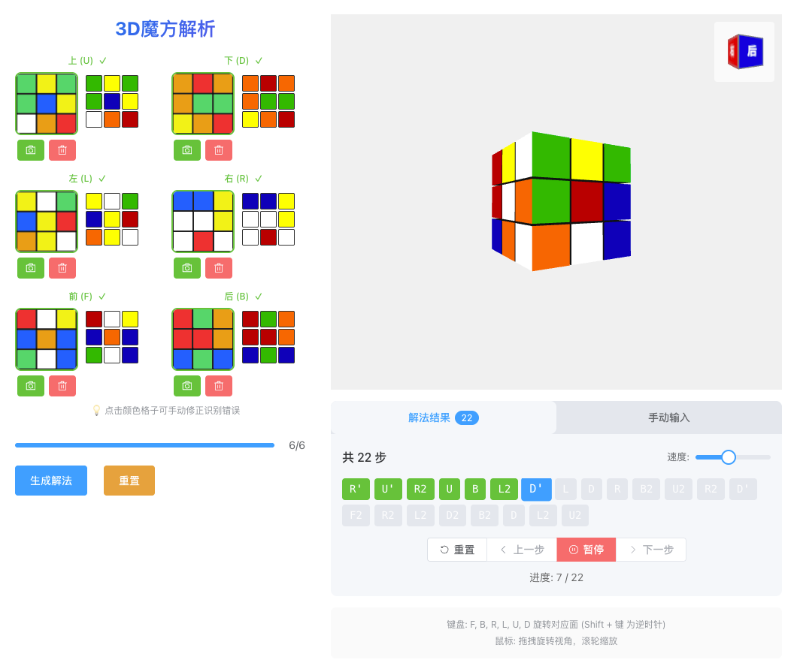

# 🎲 魔方解析器 (Rubik's Cube Solver)

一个基于 Vue 3 + TypeScript + Three.js 的在线魔方解析工具，支持通过图片识别魔方状态并生成还原解法。



## ✨ 功能特性

- 📷 **图片识别** - 上传魔方六面图片，自动识别颜色
- 📱 **拍照识别** - 支持调用摄像头实时拍照识别
- 🎨 **手动修正** - 点击颜色格子可手动修正识别错误
- 🧊 **3D 预览** - Three.js 渲染的 3D 魔方，支持拖拽旋转视角
- 🔄 **动画演示** - 解法步骤动画播放，支持单步/连续播放
- 📝 **手动输入** - 支持手动输入解法公式进行演示
- 📱 **响应式设计** - 完美适配 PC 和移动端



## 🛠️ 技术栈

- **Vue 3** - 渐进式 JavaScript 框架
- **TypeScript** - 类型安全的 JavaScript 超集
- **Vite** - 下一代前端构建工具
- **Three.js** - 3D 图形库
- **Element Plus** - Vue 3 UI 组件库
- **Pinia** - Vue 状态管理
- **cubejs** - 魔方求解算法

## 📦 安装

```bash
# 克隆项目
git clone <repository-url>
cd rubiks-cube-solver

# 安装依赖
npm install

# 启动开发服务器
npm run dev

# 构建生产版本
npm run build

# 预览生产构建
npm run preview
```

## 🚀 使用说明

### 1. 上传魔方图片

按照界面提示，依次上传魔方的六个面：

- **上 (U)** / **下 (D)**
- **左 (L)** / **右 (R)**
- **前 (F)** / **后 (B)**

支持以下方式：

- 点击上传区域选择图片
- 拖拽图片到上传区域
- 点击相机按钮拍照

### 2. 检查识别结果

上传后会显示识别出的颜色网格，如有错误可点击格子手动修正。

### 3. 生成解法

六面全部上传完成后，点击「生成解法」按钮，系统会自动计算还原步骤。

### 4. 查看解法演示

- **播放** - 自动播放全部解法步骤
- **暂停** - 暂停播放
- **上一步/下一步** - 单步控制
- **重置** - 回到初始状态
- **速度调节** - 调整动画播放速度

### 5. 3D 交互

- **鼠标拖拽** - 旋转视角
- **滚轮** - 缩放
- **键盘 F/B/R/L/U/D** - 旋转对应面（Shift + 键为逆时针）

## 📁 项目结构

```
src/
├── components/
│   ├── CubeSolver.vue    # 主组件：图片上传、解法控制
│   └── RubiksCube.vue    # 3D 魔方渲染组件
├── stores/
│   └── cubeStore.ts      # Pinia 状态管理
├── utils/
│   ├── cubeSolver.ts     # 魔方求解逻辑
│   └── imageProcessor.ts # 图片颜色识别
├── types/                # TypeScript 类型定义
├── App.vue
├── main.ts
└── style.css
```

## 🎯 魔方面标记说明

| 标记 | 中文 | 英文  | 颜色（标准配色） |
| ---- | ---- | ----- | ---------------- |
| U    | 上   | Up    | 白色             |
| D    | 下   | Down  | 黄色             |
| L    | 左   | Left  | 橙色             |
| R    | 右   | Right | 红色             |
| F    | 前   | Front | 绿色             |
| B    | 后   | Back  | 蓝色             |

## 📄 License

MIT License

## 🤝 贡献

欢迎提交 Issue 和 Pull Request！
